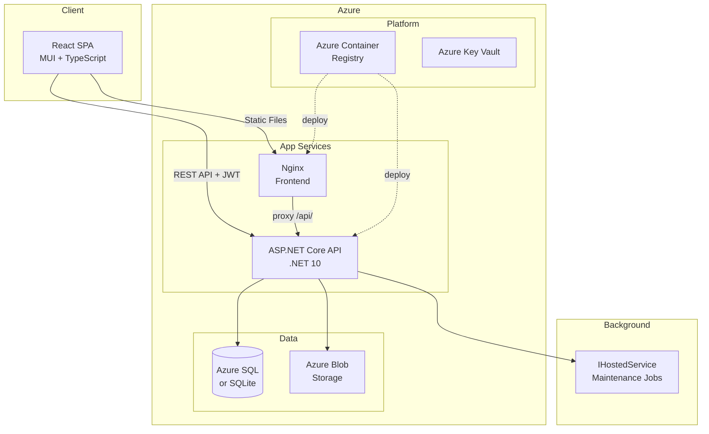
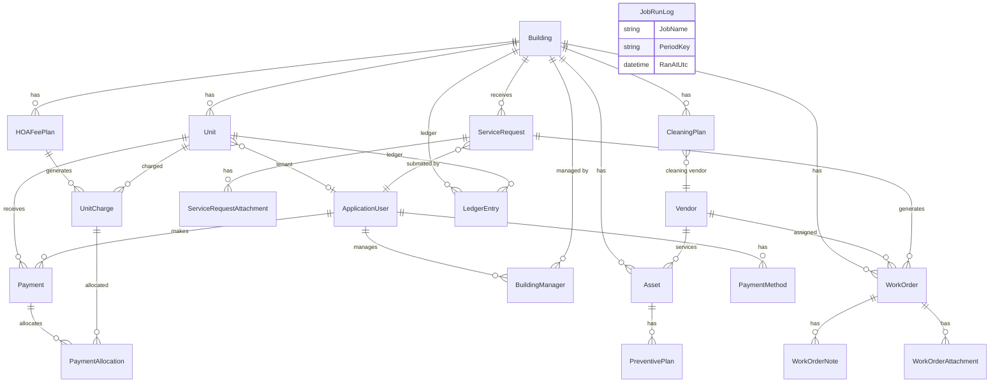
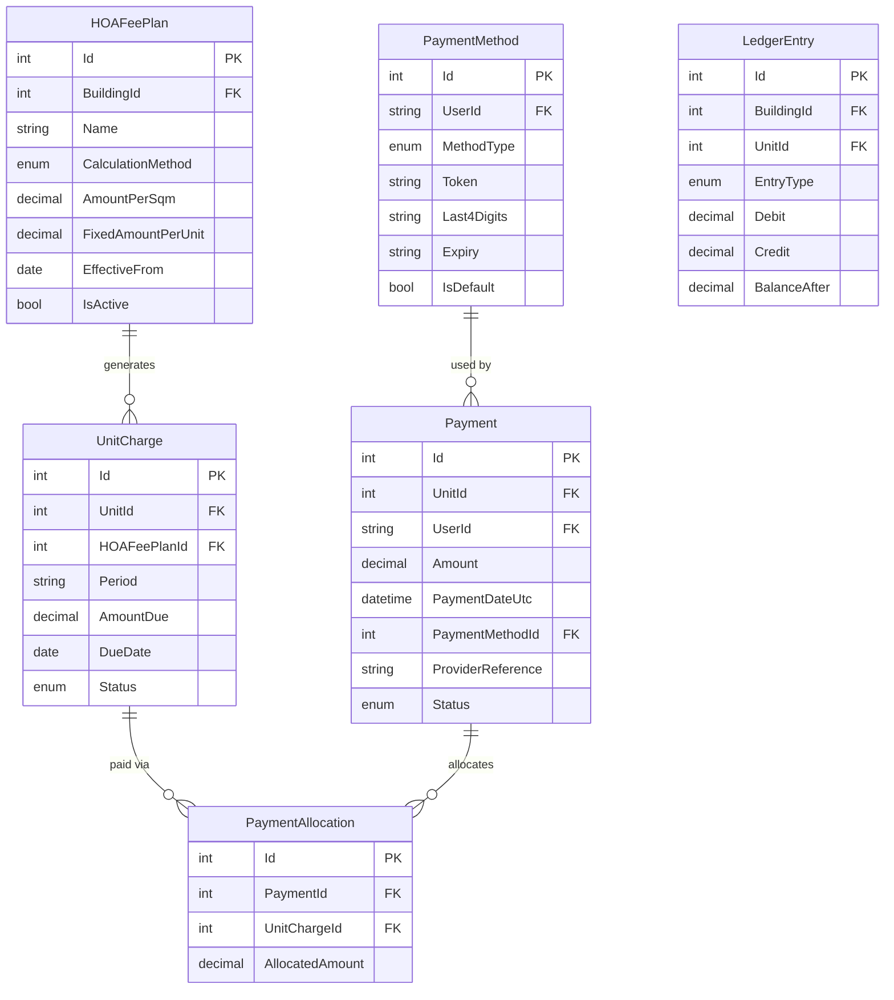

# Building Maintenance Management System

A full-stack MVP for managing building maintenance operations — service requests, work orders, vendor assignments, cleaning plans, preventive maintenance, and **HOA/Va'ad fee management with payment processing**.

## Architecture Summary

- **Backend**: ASP.NET Core (.NET 10 preview) with EF Core, Identity + JWT auth
- **Frontend**: React 19 + TypeScript + Vite + Material UI (MUI)
- **Database**: SQLite (dev) / Azure SQL (production) via EF Core code-first
- **File Storage**: Local filesystem (dev) / Azure Blob Storage (production)
- **Payments**: Provider-agnostic payment gateway (Fake / Meshulam / Pelecard / Tranzila), configurable per building
- **Background Jobs**: IHostedService with idempotent generators + recurring payment processor
- **Containerization**: Docker + docker-compose
- **CI/CD**: GitHub Actions → Azure Container Registry → Azure App Service

## Architecture Diagram



## Entity Relationship Diagram



### Finance ERD (Detail)



## Prerequisites

- [.NET 10 SDK](https://dotnet.microsoft.com/download) (preview) — or .NET 9 SDK
- [Node.js 22+](https://nodejs.org/) and npm
- [Docker](https://www.docker.com/) (optional, for containerized deployment)

## Quick Start — Local Development

### 1. Backend (ASP.NET Core API)

```bash
cd src/BuildingManagement.Api
dotnet run
```

The API starts on **http://localhost:5219**.  
Swagger UI: **http://localhost:5219/swagger**

On first run in Development mode, the database is created and seeded automatically with demo data.  
By default, the app uses an **in-memory database** (no files, no setup). Data resets on each restart.  
To persist data, set `Database:Provider` to `Sqlite` or `SqlServer` in `appsettings.json` (see [Database Configuration](#database-configuration)).

### 2. Frontend (React + Vite)

```bash
cd frontend
npm install
npm run dev
```

The frontend starts on **http://localhost:5173**.  
It proxies API calls to the backend at http://localhost:5219.

### 3. Docker Compose (all-in-one)

```bash
docker-compose up --build
```

- Backend: http://localhost:5219
- Frontend: http://localhost:3000

## Seeded Demo Users (Development Only)

| Email | Password | Role |
|-------|----------|------|
| admin@example.com | Demo@123! | Admin |
| manager@example.com | Demo@123! | Manager (Building 1) |
| tenant@example.com | Demo@123! | Tenant (Unit 101) |
| vendor@example.com | Demo@123! | Vendor (CleanCo Services) |

> **WARNING**: These credentials are for development only. Do not use in production.

## Database Migrations

```bash
# Create a new migration
dotnet ef migrations add MigrationName \
  --project src/BuildingManagement.Infrastructure \
  --startup-project src/BuildingManagement.Api

# Apply migrations
dotnet ef database update \
  --project src/BuildingManagement.Infrastructure \
  --startup-project src/BuildingManagement.Api

# Reset database (delete and re-create)
# Delete buildingmgmt.db from src/BuildingManagement.Api/ and restart
```

## API Documentation

Full API documentation is available via Swagger at:  
**http://localhost:5219/swagger** (when running in Development mode)

### Key Endpoints

| Method | Path | Description |
|--------|------|-------------|
| POST | /api/auth/login | Login, returns JWT tokens |
| POST | /api/auth/refresh | Refresh access token |
| GET | /api/buildings | List buildings |
| POST | /api/buildings | Create building |
| GET | /api/buildings/{id}/units | Get units for building |
| GET | /api/vendors | List vendors |
| POST | /api/servicerequests | Create service request |
| GET | /api/servicerequests/my | Tenant's own requests |
| PUT | /api/servicerequests/{id}/status | Update SR status |
| POST | /api/workorders | Create work order |
| GET | /api/workorders/my | Vendor's assigned WOs |
| PUT | /api/workorders/{id}/assign | Assign vendor to WO |
| PUT | /api/workorders/{id}/status | Update WO status |
| POST | /api/workorders/{id}/notes | Add note to WO |
| GET | /api/cleaningplans/{buildingId} | Get cleaning plan |
| POST | /api/cleaningplans/{buildingId}/generate-weekly | Generate cleaning WOs |
| POST | /api/jobs/generate-preventive | Generate preventive WOs |
| POST | /api/jobs/generate-cleaning-week | Generate all cleaning WOs |
| | | **HOA & Finance** |
| GET | /api/hoa/plans/{buildingId} | Get HOA fee plans |
| POST | /api/hoa/plans | Create HOA fee plan |
| PUT | /api/hoa/plans/{id} | Update HOA fee plan |
| POST | /api/hoa/plans/{id}/generate/{period} | Generate monthly charges |
| GET | /api/hoa/charges?buildingId=&period= | List charges (manager) |
| GET | /api/hoa/charges/my | Tenant's own charges |
| PUT | /api/hoa/charges/{id}/adjust | Adjust charge amount |
| POST | /api/payments/setup-method | Add payment method (tokenized) |
| GET | /api/payments/methods | List my payment methods |
| DELETE | /api/payments/methods/{id} | Remove payment method |
| POST | /api/payments/pay/{unitChargeId} | Pay an outstanding charge |
| GET | /api/payments/my | Tenant's payment history |
| POST | /api/payments/webhook | Payment webhook (anonymous) |
| GET | /api/reports/collection-status/{buildingId} | Collection report |
| GET | /api/reports/aging/{buildingId} | Aging report |
| GET | /api/reports/collection-status/{buildingId}/csv | Collection CSV export |
| GET | /api/reports/aging/{buildingId}/csv | Aging CSV export |

## Storage Configuration

### Local Development (default)
Files are stored under `wwwroot/uploads/` automatically.

### Azure Blob Storage (production)
Set these environment variables:
```
FileStorage__Provider=Azure
AzureBlob__ConnectionString=<your-azure-blob-connection-string>
AzureBlob__ContainerName=building-files
```

## Database Configuration

The database provider is controlled by the `Database:Provider` setting in `appsettings.json`. Three providers are supported:

| Provider | Setting Value | Description | Persistence |
|----------|--------------|-------------|-------------|
| **InMemory** | `InMemory` | EF Core in-memory database (default) | Data lost on restart |
| **SQLite** | `Sqlite` | SQLite file-based database | Persistent, local file |
| **SQL Server** | `SqlServer` | Azure SQL / SQL Server | Persistent, production-ready |

### InMemory (default — zero-cost demo)

No database file or server required. Data is seeded on every startup and lost when the app stops. Ideal for demos, quick testing, and development.

```json
{
  "Database": {
    "Provider": "InMemory"
  }
}
```

### SQLite (persistent local dev)

Data persists across restarts in a local `.db` file. Requires `ConnectionStrings:DefaultConnection`.

```json
{
  "Database": {
    "Provider": "Sqlite"
  },
  "ConnectionStrings": {
    "DefaultConnection": "Data Source=buildingmgmt.db"
  }
}
```

### SQL Server / Azure SQL (production)

```json
{
  "Database": {
    "Provider": "SqlServer"
  },
  "ConnectionStrings": {
    "DefaultConnection": "Server=your-server.database.windows.net;Database=BuildingMgmt;User Id=admin;Password=YOUR_PASSWORD;Encrypt=True;TrustServerCertificate=False;"
  }
}
```

Or via environment variables:
```
Database__Provider=SqlServer
ConnectionStrings__DefaultConnection=Server=...
```

> **Note**: EF Core migrations are only applied for `Sqlite` and `SqlServer` providers. The `InMemory` provider uses `EnsureCreated` to build the schema from the model directly.

## Azure Deployment

### 1. Create Azure Resources

```bash
# Variables
RG=building-mgmt-rg
LOCATION=westeurope
ACR_NAME=buildingmgmtacr
APP_PLAN=building-mgmt-plan
API_APP=building-mgmt-api
FE_APP=building-mgmt-frontend
SQL_SERVER=building-mgmt-sql
SQL_DB=BuildingMgmt

# Resource Group
az group create --name $RG --location $LOCATION

# Azure Container Registry
az acr create --resource-group $RG --name $ACR_NAME --sku Basic --admin-enabled true

# Get ACR credentials
az acr credential show --name $ACR_NAME

# Azure SQL
az sql server create --name $SQL_SERVER --resource-group $RG \
  --location $LOCATION --admin-user sqladmin --admin-password 'YourStrongPassword123!'
az sql db create --resource-group $RG --server $SQL_SERVER --name $SQL_DB \
  --service-objective S0
az sql server firewall-rule create --resource-group $RG --server $SQL_SERVER \
  --name AllowAzure --start-ip-address 0.0.0.0 --end-ip-address 0.0.0.0

# App Service Plan (Linux)
az appservice plan create --name $APP_PLAN --resource-group $RG \
  --is-linux --sku B1

# Backend App Service
az webapp create --resource-group $RG --plan $APP_PLAN --name $API_APP \
  --deployment-container-image-name $ACR_NAME.azurecr.io/building-management-api:latest

# Frontend App Service
az webapp create --resource-group $RG --plan $APP_PLAN --name $FE_APP \
  --deployment-container-image-name $ACR_NAME.azurecr.io/building-management-frontend:latest
```

### 2. Configure App Settings

```bash
az webapp config appsettings set --resource-group $RG --name $API_APP --settings \
  ASPNETCORE_ENVIRONMENT=Production \
  "ConnectionStrings__DefaultConnection=Server=$SQL_SERVER.database.windows.net;Database=$SQL_DB;User Id=sqladmin;Password=YourStrongPassword123!;Encrypt=True;" \
  "Jwt__Key=YourProductionJwtSecretKeyAtLeast32Characters!" \
  FileStorage__Provider=Azure \
  "AzureBlob__ConnectionString=<your-blob-connection-string>" \
  AllowedHosts=*
```

### 3. Build & Push Images

```bash
# Login to ACR
az acr login --name $ACR_NAME

# Build and push
docker build -t $ACR_NAME.azurecr.io/building-management-api:latest -f src/BuildingManagement.Api/Dockerfile .
docker push $ACR_NAME.azurecr.io/building-management-api:latest

docker build -t $ACR_NAME.azurecr.io/building-management-frontend:latest -f frontend/Dockerfile frontend
docker push $ACR_NAME.azurecr.io/building-management-frontend:latest
```

### 4. GitHub Actions

Configure these secrets in your GitHub repository:
- `AZURE_CREDENTIALS` — Azure service principal JSON
- `ACR_LOGIN_SERVER` — e.g., `buildingmgmtacr.azurecr.io`
- `ACR_USERNAME` — ACR admin username
- `ACR_PASSWORD` — ACR admin password
- `AZURE_SQL_CONNECTION_STR` — SQL connection string
- `JWT_SECRET_KEY` — Production JWT signing key
- `AZURE_BLOB_CONNECTION_STRING` — Blob storage connection string

The workflow at `.github/workflows/azure-deploy.yml` builds, pushes, and deploys automatically on push to `main`.

### Future Improvements (Azure)
- Use **Azure Managed Identity** instead of connection strings for Blob Storage and SQL
- Store secrets in **Azure Key Vault** and reference them from App Settings
- Use **Azure Container Apps** for auto-scaling and revision management
- Enable **Application Insights** for monitoring and logging

## Roles & Access Control

| Role | Capabilities |
|------|-------------|
| **Admin** | Full access to all entities, buildings, finance, and features |
| **Manager** | Manage assigned buildings, triage SRs, create WOs, run generators, manage HOA plans & charges, view reports |
| **Tenant** | Submit service requests, view own requests, view own charges, add payment methods, pay charges |
| **Vendor** | View assigned work orders, update status, add notes/photos. **No access to finance endpoints** |

## Technology Stack

| Layer | Technology |
|-------|-----------|
| Backend API | ASP.NET Core (.NET 10 preview), EF Core 9 |
| Authentication | ASP.NET Core Identity + JWT Bearer tokens |
| Database | SQLite (dev) / Azure SQL (prod) |
| File Storage | Local filesystem / Azure Blob Storage |
| Frontend | React 19, TypeScript, Vite, Material UI |
| HTTP Client | Axios with token refresh interceptor |
| Routing | React Router v7 |
| Containerization | Docker, docker-compose |
| CI/CD | GitHub Actions |
| Cloud | Azure App Service, ACR, Azure SQL, Blob Storage |

## HOA / Finance Module

### HOA Fee Calculation Methods

| Method | Description |
|--------|-------------|
| **BySqm** | Amount = `unit.SizeSqm × plan.AmountPerSqm` |
| **FixedPerUnit** | Amount = `plan.FixedAmountPerUnit` (same for all units) |
| **ManualPerUnit** | Manager sets each unit's charge manually via the adjust endpoint |

### How Recurring Payments Work

1. A `RecurringPaymentJob` background service runs daily (when enabled via `Jobs:RecurringPaymentsEnabled=true`).
2. It finds all `Pending` or `Overdue` charges where the unit's tenant has a default active `PaymentMethod`.
3. It resolves the correct gateway per building via `IPaymentGatewayFactory`, then calls `ChargeTokenAsync`.
4. On success: creates `Payment` + `PaymentAllocation`, updates `UnitCharge` status, creates `LedgerEntry`, sends email.
5. On failure: logs error, retries on next run (max 3 attempts per charge).
6. Idempotency: uses `JobRunLog` to skip if already processed for the current day.

### Israeli Payment Gateways

The system supports these Israeli payment providers via a **provider-agnostic** `IPaymentGateway` interface:

| Provider | Status | API Docs | Features |
|----------|--------|----------|----------|
| **Fake** | Fully working | — | Hosted page simulation, tokenization, recurring, refunds, webhooks |
| **Meshulam (משולם)** | Skeleton with TODO | https://meshulam.co.il/developers | Hosted page, tokenization, recurring, refunds, webhooks |
| **Pelecard (פלאקרד)** | Skeleton with TODO | https://gateway20.pelecard.biz/ | Hosted page, tokenization (J4/J5), recurring, refunds, IPN |
| **Tranzila (טרנזילה)** | Skeleton with TODO | https://docs.tranzila.com/ | Iframe page, TrToken, recurring, credit transactions, IPN |

### Payment Flow Architecture

Two main flows are supported:

**1. One-time Payment (Hosted Page)**
```
Tenant → API (POST /api/payments/session/{chargeId}) → Gateway creates session
→ Tenant redirected to provider hosted page → Provider processes payment
→ Provider calls webhook (POST /api/payments/webhook/{providerType})
→ Payment + Charge status updated → Tenant redirected to /payment/success
```

**2. Recurring (Standing Order via Token)**
```
Tenant → API (POST /api/payments/tokenize) → Gateway returns hosted page URL
→ Tenant enters card on provider page → Token returned via webhook/redirect
→ PaymentMethod saved with token + last4 → Monthly: RecurringPaymentJob
→ ChargeTokenAsync with saved token → Webhook confirms → Ledger updated
```

### PCI Compliance & Security

- **We NEVER collect or store raw credit card numbers or CVV** in our system
- All card data entry happens on the **provider's hosted payment page** (iframe/redirect)
- We store only: token, last4, expiry, card brand, provider customer ID
- Webhook signatures are **fail-closed** for real providers (rejected if verification fails)
- All provider API secrets are stored as **Azure Key Vault secret references** (not actual values)
- Webhook payloads with sensitive data are **never logged in full**
- Webhook endpoints should be **rate-limited** in production

### Provider Configuration (Per Building)

Providers are configured via `PaymentProviderConfig` entities, scoped per building or global:

```bash
# List provider configs (Admin/Manager)
curl http://localhost:5062/api/payment-config -H "Authorization: Bearer $TOKEN"

# Set Meshulam for a specific building
curl -X POST http://localhost:5062/api/payment-config \
  -H "Authorization: Bearer $TOKEN" -H "Content-Type: application/json" \
  -d '{"buildingId":1,"providerType":"Meshulam","merchantIdRef":"kv-meshulam-merchant","apiPasswordRef":"kv-meshulam-apikey","supportedFeatures":31,"currency":"ILS"}'
```

The `supportedFeatures` is a bitmask: HostedPaymentPage=1, Tokenization=2, RecurringCharges=4, Refunds=8, Webhooks=16 (31=all).

### Webhook Handling

Webhooks are routed per provider:
- `POST /api/payments/webhook/Fake`
- `POST /api/payments/webhook/Meshulam`
- `POST /api/payments/webhook/Pelecard`
- `POST /api/payments/webhook/Tranzila`

Each webhook:
1. Parses the payload using the provider-specific gateway
2. Verifies signature (fail-closed for real providers)
3. Checks `WebhookEventLog` for duplicate event IDs (idempotency)
4. Updates `Payment.Status`, `UnitCharge.Status`, `LedgerEntry`
5. Logs the event in `WebhookEventLog`

### Switching from Fake to Real Provider

1. Get API credentials from the provider (Meshulam/Pelecard/Tranzila)
2. Store them in Azure Key Vault:
   ```bash
   az keyvault secret set --vault-name myVault --name meshulam-merchant-id --value "YOUR_MERCHANT_ID"
   az keyvault secret set --vault-name myVault --name meshulam-api-key --value "YOUR_API_KEY"
   ```
3. Reference Key Vault secrets in Azure App Service settings:
   ```
   Payment__Providers__Meshulam__MerchantId=@Microsoft.KeyVault(SecretUri=https://myVault.vault.azure.net/secrets/meshulam-merchant-id)
   ```
4. Create/update a `PaymentProviderConfig` via the admin UI or API with the Key Vault secret names
5. Complete the TODO sections in the gateway implementation (`MeshulamGateway.cs` etc.)
6. Set the webhook URL in the provider's dashboard to: `https://yourdomain.com/api/payments/webhook/Meshulam`

### Fake Gateway (Development)

The `FakePaymentGateway` fully simulates the hosted payment flow:
- **CreatePaymentSession**: Returns a redirect URL to `/payment/success` with simulated params
- **Tokenize**: Returns a fake token (fake_tok_...) with last4=1111, brand=Visa
- **ChargeToken**: Succeeds unless token contains `_fail_`
- **Webhook**: Parses JSON, accepts all signatures
- **Refund**: Always succeeds

### Reports

| Report | Endpoint | Description |
|--------|----------|-------------|
| Collection Status | `GET /api/reports/collection-status/{buildingId}?period=YYYY-MM` | Per-unit breakdown: due, paid, balance, status + totals |
| Aging | `GET /api/reports/aging/{buildingId}` | Outstanding balances in buckets: Current, 1-30d, 31-60d, 61-90d, 90+d |
| CSV Export | Append `/csv` to either report endpoint | Downloadable CSV file |

### Health Check

```bash
curl http://localhost:5062/health
# Returns "Healthy" if the database is accessible
```

### Azure Deployment — Payment Settings

Add these App Settings in Azure App Service:

| Setting | Description |
|---------|-------------|
| `Payment__DefaultProvider` | Optional: global default provider (Fake/Meshulam/Pelecard/Tranzila) |
| `Payment__Providers__Meshulam__MerchantId` | Key Vault reference for Meshulam merchant ID |
| `Payment__Providers__Meshulam__ApiKey` | Key Vault reference for Meshulam API key |
| `Payment__Providers__Pelecard__Terminal` | Key Vault reference for Pelecard terminal |
| `Payment__Providers__Pelecard__User` | Key Vault reference for Pelecard user |
| `Payment__Providers__Pelecard__Password` | Key Vault reference for Pelecard password |
| `Payment__Providers__Tranzila__Supplier` | Key Vault reference for Tranzila supplier/terminal |

### Example API Calls

```bash
# Create HOA plan (Manager)
curl -X POST http://localhost:5062/api/hoa/plans \
  -H "Authorization: Bearer $TOKEN" -H "Content-Type: application/json" \
  -d '{"buildingId":1,"name":"Monthly HOA 2026","calculationMethod":"FixedPerUnit","fixedAmountPerUnit":500,"effectiveFrom":"2026-01-01"}'

# Generate charges
curl -X POST http://localhost:5062/api/hoa/plans/1/generate/2026-02 \
  -H "Authorization: Bearer $TOKEN"

# Start hosted tokenization (Tenant — redirects to provider)
curl -X POST http://localhost:5062/api/payments/tokenize \
  -H "Authorization: Bearer $TOKEN" -H "Content-Type: application/json" \
  -d '{"buildingId":1,"isDefault":true}'

# Create hosted payment session (Tenant — redirects to provider)
curl -X POST http://localhost:5062/api/payments/session/1 \
  -H "Authorization: Bearer $TOKEN"

# Pay via saved token (Tenant — direct charge)
curl -X POST http://localhost:5062/api/payments/pay/1 \
  -H "Authorization: Bearer $TOKEN" -H "Content-Type: application/json" \
  -d '{"paymentMethodId":1}'

# Simulate webhook
curl -X POST http://localhost:5062/api/payments/webhook/Fake \
  -H "Content-Type: application/json" \
  -d '{"eventId":"evt-123","providerReference":"fake_ch_xyz","status":"succeeded"}'

# Collection report CSV
curl http://localhost:5062/api/reports/collection-status/1/csv?period=2026-02 \
  -H "Authorization: Bearer $TOKEN" -o report.csv
```

## Internationalization (i18n) & RTL Support

### Overview

The UI is fully bilingual: **Hebrew (default)** and **English**. Hebrew uses RTL (right-to-left) layout; English uses LTR.

### How to Switch Language

- **From the App Bar**: Click the `עברית` / `English` toggle in the top toolbar (available on every page).
- **On the Login Page**: A language toggle appears at the top of the login card.
- Language choice is persisted in `localStorage` (key: `lang`) and optionally saved to the user profile on the server.

### Translation Files

All UI strings are externalized into JSON translation files:

| Language | File Path |
|----------|-----------|
| Hebrew (default) | `frontend/src/i18n/locales/he/translation.json` |
| English | `frontend/src/i18n/locales/en/translation.json` |

Translation keys are organized by section: `app.*`, `nav.*`, `login.*`, `dashboard.*`, `buildings.*`, `vendors.*`, `assets.*`, `serviceRequests.*`, `workOrders.*`, `cleaning.*`, `jobs.*`, `hoa.*`, `paymentConfig.*`, `myCharges.*`, `myRequests.*`, `newRequest.*`, `payment.*`, `vendorWo.*`, and `enums.*` (for status/type labels).

### RTL Implementation

- **Emotion + stylis-plugin-rtl**: MUI styles are automatically flipped for RTL using `stylis-plugin-rtl` via a custom Emotion cache.
- **MUI Theme Direction**: The MUI theme's `direction` property is set dynamically based on the selected language.
- **Document Direction**: `document.documentElement.dir` and `document.documentElement.lang` are updated on language change.
- **Caches**: Separate Emotion caches (`muirtl` / `muiltr`) ensure clean style injection for each direction.

### Date & Number Formatting

- Dates use `Intl.DateTimeFormat` with `he-IL` or `en-US` locale depending on the active language.
- Numbers and currency use `Intl.NumberFormat` with locale-appropriate formatting.
- Currency display: ILS (₪) by default.
- All dates displayed in `Asia/Jerusalem` timezone.

### Backend Language Support

- **User Preference**: `ApplicationUser.PreferredLanguage` field (`"he"` | `"en"`), defaulting to `"he"`.
- **API Endpoint**: `PUT /api/auth/me/language` with body `{ "language": "he" }` to persist preference.
- **GET /api/auth/me** returns `preferredLanguage` in the response.
- **Server error messages remain in English** — this is by design. Only the UI wrapper text (e.g., "An error occurred") is translated.

### CSV Export Localization

CSV report exports accept a `lang` query parameter:

- `GET /api/reports/collection-status/{buildingId}/csv?period=2025-01&lang=he` → Hebrew column headers
- `GET /api/reports/aging/{buildingId}/csv?lang=en` → English column headers

CSV files include a UTF-8 BOM for proper Hebrew display in Excel.

### Adding a New Language

1. Create `frontend/src/i18n/locales/{code}/translation.json` (copy from `en/translation.json`).
2. Add the language code to `supportedLngs` in `frontend/src/i18n/index.ts`.
3. Add a new toggle option in `Layout.tsx` and `LoginPage.tsx`.
4. Add CSV headers in `ReportsController.cs` `CsvHeaders` dictionary.

---

## Assumptions

- Currency defaults to ILS (Israeli Shekel)
- UI defaults to Hebrew with full RTL support; English available via language toggle
- Max 5 image attachments per service request (JPG, PNG, WebP ≤ 10MB each)
- Email notifications use a logging implementation in dev (SMTP configurable for production)
- Refresh tokens stored in-memory (production should use database-backed store)
- Single management company assumed (multi-company support can be added)
- Timezone: All timestamps stored as UTC, displayed as Asia/Jerusalem in the UI

## License

MIT
